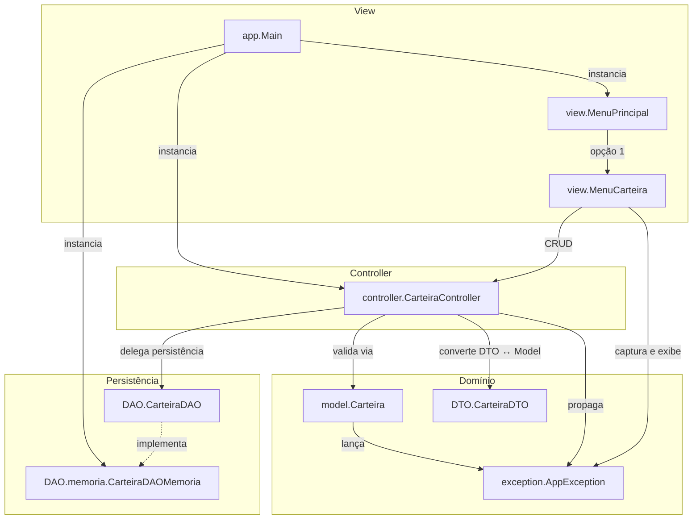
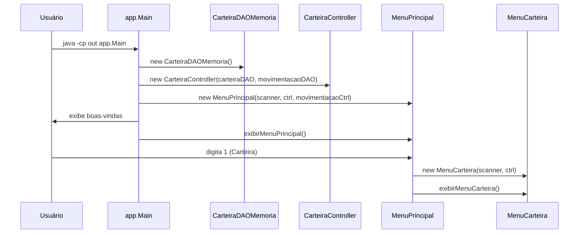
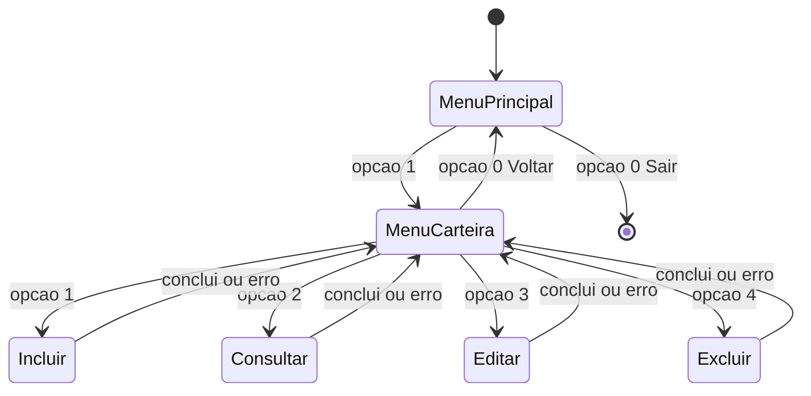
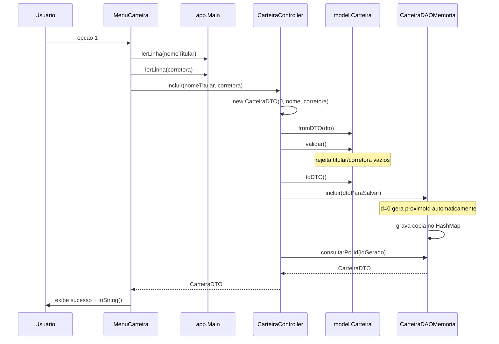
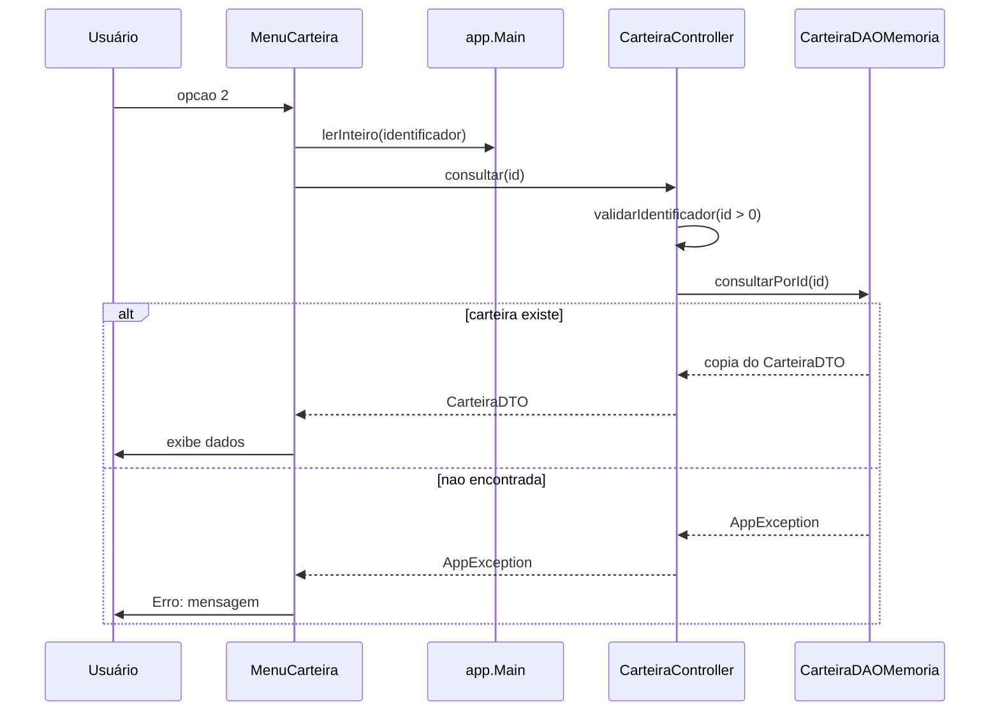
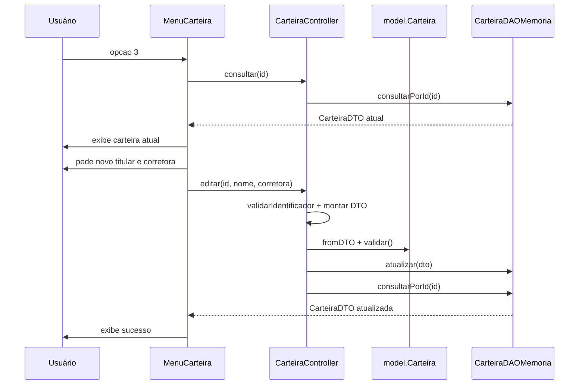
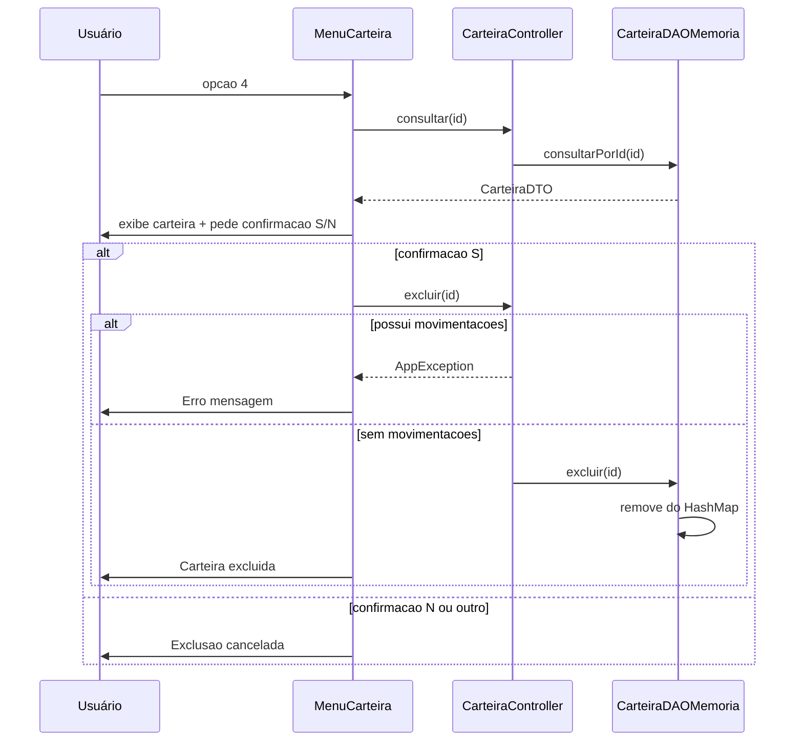
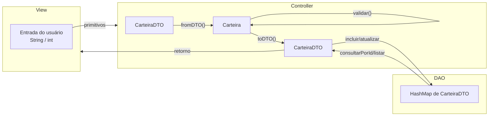
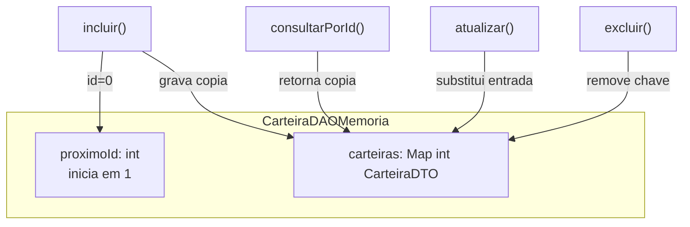

# Fluxo de Carteira (FT_Coin)

Este documento descreve **como o fluxo de carteira funciona hoje** no código em `src/`.

---

## 1. Visão geral da arquitetura

O fluxo segue **MVC + DTO + DAO**, com persistência em memória para demonstração.



### Papel de cada componente

| Componente | Arquivo | Responsabilidade no fluxo |
|------------|---------|---------------------------|
| **Main** | [src/app/Main.java](../src/app/Main.java) | Bootstrap: cria DAOs em memória, `CarteiraController`, `MovimentacaoController` e `MenuPrincipal`; helpers `lerOpcao`, `lerLinha`, `lerInteiro`, `lerData`, `lerDouble` |
| **MenuPrincipal** | [src/view/MenuPrincipal.java](../src/view/MenuPrincipal.java) | Menu raiz; opção **1 (Carteira)** abre `MenuCarteira`; opção **2 (Movimentação)** abre `MenuMovimentacao` (ver [fluxo-movimentacao.md](fluxo-movimentacao.md)) |
| **MenuCarteira** | [src/view/MenuCarteira.java](../src/view/MenuCarteira.java) | Submenu CRUD; lê dados do usuário, chama o controller e exibe resultado ou erro |
| **CarteiraController** | [src/controller/CarteiraController.java](../src/controller/CarteiraController.java) | Orquestra regras: valida identificador, monta DTO, converte para `Carteira`, valida campos e delega ao DAO |
| **Carteira (model)** | [src/model/Carteira.java](../src/model/Carteira.java) | Entidade de domínio; valida `nomeTitular` e `corretora`; converte `fromDTO()` / `toDTO()` |
| **CarteiraDTO** | [src/DTO/CarteiraDTO.java](../src/DTO/CarteiraDTO.java) | Objeto de transferência entre view, controller e DAO (3 campos: `identificador`, `nomeTitular`, `corretora`) |
| **CarteiraDAO** | [src/DAO/CarteiraDAO.java](../src/DAO/CarteiraDAO.java) | Contrato de persistência (interface) |
| **CarteiraDAOMemoria** | [src/DAO/memoria/CarteiraDAOMemoria.java](../src/DAO/memoria/CarteiraDAOMemoria.java) | Implementação com `HashMap<Integer, CarteiraDTO>`; gera IDs automaticamente |
| **AppException** | [src/exception/AppException.java](../src/exception/AppException.java) | Exceção checked para erros de negócio e validação |

---

## 2. Bootstrap — como a aplicação inicia o fluxo



**Injeção de dependências:** o `CarteiraController` recebe a interface `CarteiraDAO`, não a implementação concreta. Hoje [Main.java](../src/app/Main.java) usa `CarteiraDAOMemoria`; no futuro pode trocar por `CarteiraDAOMariaDB` sem alterar controller ou view.

---

## 3. Navegação nos menus



**Comportamento do loop:**

- `MenuPrincipal` e `MenuCarteira` usam `while (true)` — após cada operação, o submenu permanece aberto até o usuário escolher **0 (Voltar/Sair)**.
- Opções inválidas no submenu de carteira exibem mensagem e **não encerram** o programa (diferente do menu principal, que lança `RuntimeException`).

---

## 4. Operações CRUD — passo a passo

### 4.1 Incluir carteira



**Regras aplicadas:**

- ID inicia em `0`; o DAO atribui `proximoId` (1, 2, 3…).
- Validação de campos ocorre no **model**, não na view.
- O DAO armazena uma **cópia** do DTO para evitar mutação externa.

---

### 4.2 Consultar carteira



---

### 4.3 Editar carteira



**Observação:** a edição exige que a carteira exista (consulta prévia) e revalida titular/corretora antes de persistir.

---

### 4.4 Excluir carteira



**Observação:** antes de excluir, `CarteiraController` consulta `MovimentacaoDAO.possuiMovimentacoes(id)`. Carteiras com compras ou vendas **não podem** ser removidas.

---

## 5. Fluxo de dados (DTO vs Model)



**Por que duas representações?**

- **CarteiraDTO:** transporta dados entre camadas sem expor lógica de domínio à view/DAO.
- **Carteira (model):** concentra validações de negócio (`validar()`).
- O controller é o **único ponto** que converte entre DTO e Model.

---

## 6. Tratamento de erros

| Origem | Exemplo | Quem lança | Quem captura |
|--------|---------|------------|--------------|
| Entrada numérica inválida | usuário digita "abc" como ID | `Main.lerInteiro()` → `AppException` | `MenuCarteira` (catch) |
| Titular/corretora vazios | campos em branco | `Carteira.validar()` → `AppException` | `MenuCarteira` (catch) |
| ID inválido | id <= 0 | `CarteiraController.validarIdentificador()` | `MenuCarteira` (catch) |
| Carteira inexistente | id 99 não cadastrado | `CarteiraDAOMemoria.consultarPorId()` | `MenuCarteira` (catch) |
| Carteira com movimentações | excluir após compra/venda | `CarteiraController.excluir()` | `MenuCarteira` (catch) |
| Opção inválida no menu principal | digita 9 | `RuntimeException` | `Main.main()` (catch genérico) |

Todas as operações do submenu exibem `Erro: {mensagem}` e **retornam ao loop do menu**, sem encerrar a aplicação.

---

## 7. Estado persistido em memória



**Importante:** os dados existem apenas enquanto a JVM está ativa. Ao sair (`System.exit(0)`), todo o conteúdo do `HashMap` é perdido.

---

## 8. Mapa de arquivos envolvidos no fluxo

```
src/
├── app/Main.java                      ← bootstrap + leitura CLI
├── view/
│   ├── MenuPrincipal.java             ← roteia para MenuCarteira
│   └── MenuCarteira.java              ← 4 operações CRUD
├── controller/CarteiraController.java ← orquestração (+ bloqueio exclusão)
├── model/Carteira.java                ← validação + conversão
├── DTO/CarteiraDTO.java               ← transporte de dados
├── DAO/
│   ├── CarteiraDAO.java               ← contrato
│   └── memoria/CarteiraDAOMemoria.java← persistência atual
└── exception/AppException.java        ← erros de negócio
```

---

## 9. Execução manual (referência)

```powershell
javac -encoding UTF-8 -sourcepath src -d out src/app/Main.java
java -cp out app.Main
```

**Caminho típico de teste:** Menu Principal → 1 (Carteira) → 1 (Incluir) → informar titular e corretora → 2 (Consultar) → informar ID gerado → 0 (Voltar) → 0 (Sair).

---

## 10. Limitações atuais (contexto para evolução)

- `CarteiraController.listarTodas()` existe, mas **não é exposta** no menu — será usada futuramente em Relatórios.
- Implementação JDBC (`CarteiraDAOMariaDB`) ainda vazia; produção usaria a mesma interface `CarteiraDAO`.
- Exclusão bloqueia carteiras com movimentações vinculadas (ver [fluxo-movimentacao.md](fluxo-movimentacao.md)).
- Menu principal ainda não conecta Relatórios e Ajuda; Movimentação está integrada (opção 2).
