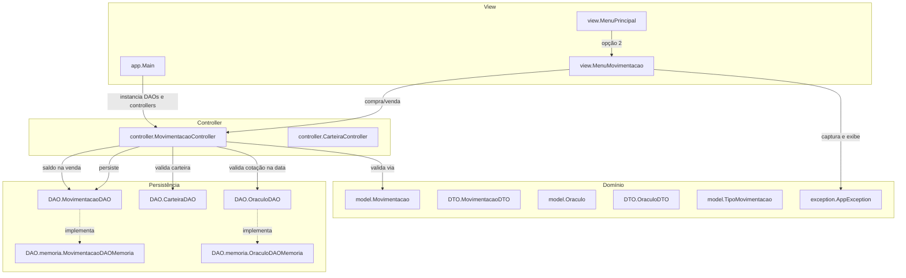
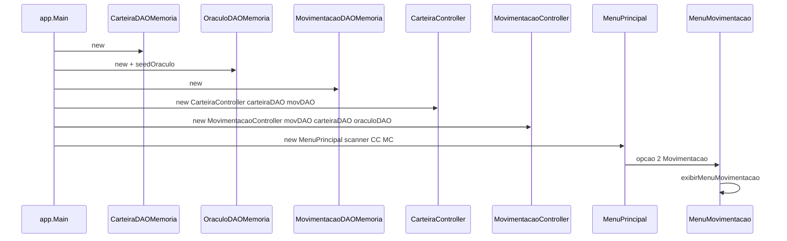
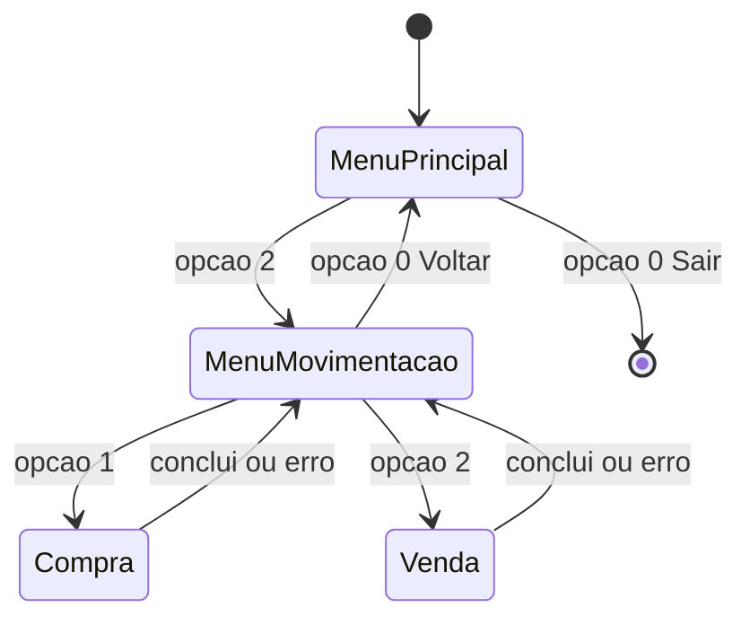
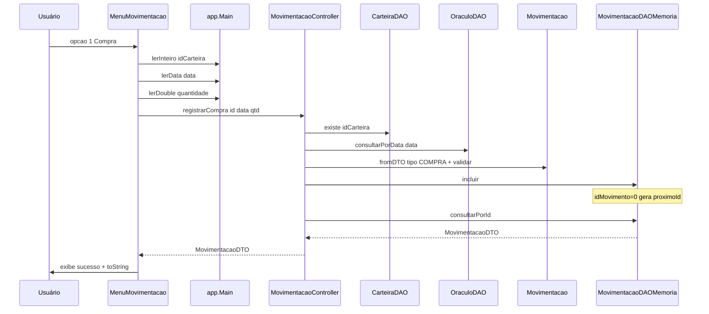
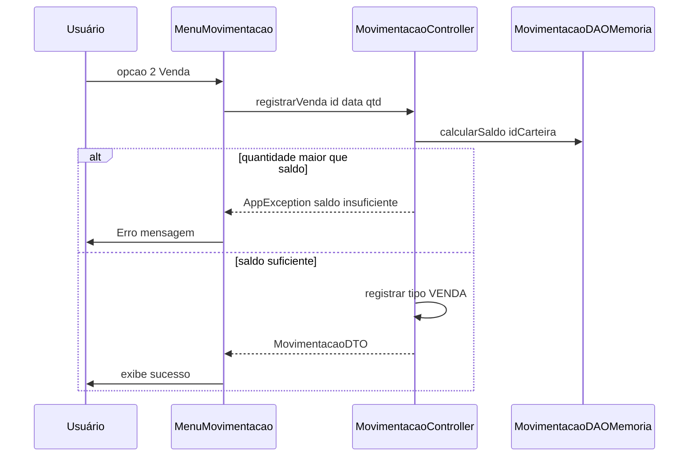
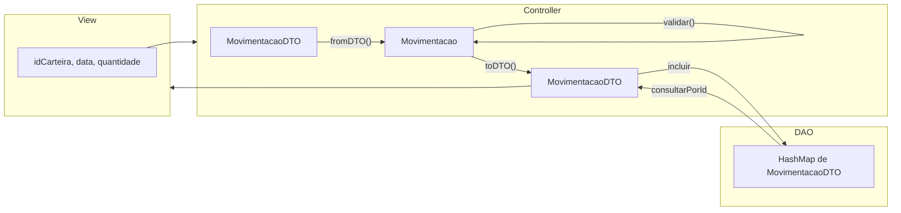
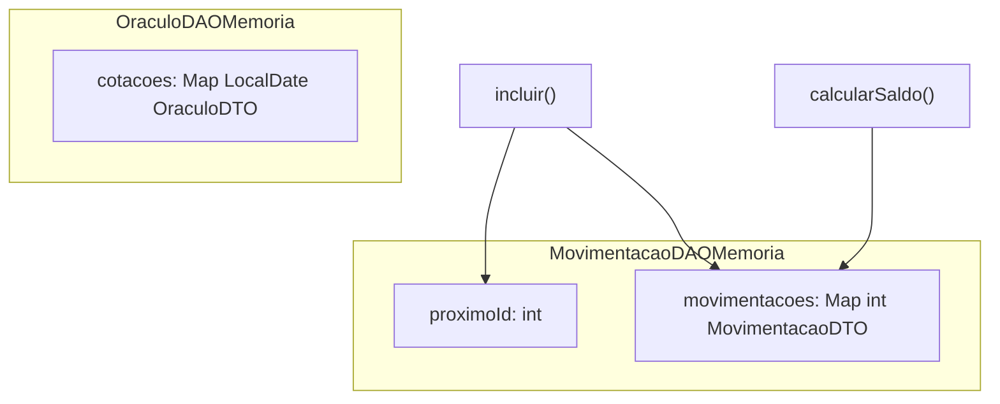

# Fluxo de Movimentação (FT_Coin)

Este documento descreve **como o fluxo de movimentação funciona hoje** no código em `src/`, incluindo a dependência mínima do **Oráculo** (cotação por data).

---

## 1. Visão geral da arquitetura

O fluxo segue **MVC + DTO + DAO**, espelhando o padrão da carteira, com persistência em memória.



### Papel de cada componente

| Componente | Arquivo | Responsabilidade no fluxo |
|------------|---------|---------------------------|
| **Main** | [src/app/Main.java](../src/app/Main.java) | Bootstrap: cria DAOs em memória, controllers, seed de cotações; helpers `lerData`, `lerDouble`, `lerInteiro` |
| **MenuPrincipal** | [src/view/MenuPrincipal.java](../src/view/MenuPrincipal.java) | Menu raiz; opção **2 (Movimentação)** abre `MenuMovimentacao` |
| **MenuMovimentacao** | [src/view/MenuMovimentacao.java](../src/view/MenuMovimentacao.java) | Submenu compra/venda; lê ID da carteira, data e quantidade |
| **MovimentacaoController** | [src/controller/MovimentacaoController.java](../src/controller/MovimentacaoController.java) | Valida carteira, cotação na data, saldo (venda); orquestra inclusão |
| **Movimentacao (model)** | [src/model/Movimentacao.java](../src/model/Movimentacao.java) | Valida campos; `fromDTO()` / `toDTO()` |
| **TipoMovimentacao** | [src/model/TipoMovimentacao.java](../src/model/TipoMovimentacao.java) | Enum `COMPRA (C)` e `VENDA (V)` |
| **MovimentacaoDTO** | [src/DTO/MovimentacaoDTO.java](../src/DTO/MovimentacaoDTO.java) | Transporte: `idMovimento`, `idCarteira`, `data`, `tipo`, `quantidade` |
| **Oraculo / OraculoDTO** | [src/model/Oraculo.java](../src/model/Oraculo.java), [src/DTO/OraculoDTO.java](../src/DTO/OraculoDTO.java) | Cotação diária usada para validar a data da movimentação |
| **MovimentacaoDAO** | [src/DAO/MovimentacaoDAO.java](../src/DAO/MovimentacaoDAO.java) | Contrato: incluir, consultar, listar por carteira, saldo, vínculos |
| **MovimentacaoDAOMemoria** | [src/DAO/memoria/MovimentacaoDAOMemoria.java](../src/DAO/memoria/MovimentacaoDAOMemoria.java) | `HashMap` + `proximoId` global |
| **OraculoDAOMemoria** | [src/DAO/memoria/OraculoDAOMemoria.java](../src/DAO/memoria/OraculoDAOMemoria.java) | `Map<LocalDate, OraculoDTO>` |

---

## 2. Bootstrap — como a aplicação inicia o fluxo



**Seed do Oráculo:** na inicialização, [Main.java](../src/app/Main.java) cadastra cotações para **hoje** e **ontem** (150,0 e 145,0), permitindo testar compra/venda sem menu de cotação.

**Injeção de dependências:** controllers recebem interfaces `*DAO`, não implementações concretas.

---

## 3. Navegação nos menus



**Comportamento do loop:**

- Opções inválidas no submenu exibem mensagem e **não encerram** o programa (padrão `MenuCarteira`).
- O tipo (`C`/`V`) é definido pela opção do menu, não digitado pelo usuário.

---

## 4. Operações — passo a passo

### 4.1 Compra de moeda virtual



---

### 4.2 Venda de moeda virtual



**Saldo:** `saldo = Σ compras − Σ vendas` por carteira, calculado em `MovimentacaoDAOMemoria.calcularSaldo()`.

---

## 5. Fluxo de dados (DTO vs Model)



---

## 6. Tratamento de erros

| Origem | Exemplo | Quem lança | Quem captura |
|--------|---------|------------|--------------|
| Entrada numérica inválida | "abc" como ID | `Main.lerInteiro()` | `MenuMovimentacao` |
| Data inválida | formato errado | `Main.lerData()` | `MenuMovimentacao` |
| Quantidade inválida | ≤ 0 | `Movimentacao.validar()` | `MenuMovimentacao` |
| Carteira inexistente | ID não cadastrado | `MovimentacaoController` | `MenuMovimentacao` |
| Sem cotação na data | data sem seed | `OraculoDAOMemoria` | `MenuMovimentacao` |
| Saldo insuficiente | venda acima do saldo | `MovimentacaoController` | `MenuMovimentacao` |
| Exclusão de carteira com movimentos | excluir após compra | `CarteiraController.excluir()` | `MenuCarteira` |

---

## 7. Estado persistido em memória



---

## 8. Mapa de arquivos envolvidos no fluxo

```
src/
├── app/Main.java                           ← bootstrap, seed oráculo, lerData/lerDouble
├── view/
│   ├── MenuPrincipal.java                  ← roteia opção 2
│   └── MenuMovimentacao.java               ← compra e venda
├── controller/
│   ├── MovimentacaoController.java
│   └── CarteiraController.java             ← bloqueio exclusão com movimentos
├── model/
│   ├── Movimentacao.java
│   ├── TipoMovimentacao.java
│   └── Oraculo.java
├── DTO/
│   ├── MovimentacaoDTO.java
│   └── OraculoDTO.java
├── DAO/
│   ├── MovimentacaoDAO.java
│   ├── OraculoDAO.java
│   └── memoria/
│       ├── MovimentacaoDAOMemoria.java
│       └── OraculoDAOMemoria.java
└── exception/AppException.java
```

---

## 9. Execução manual (referência)

```powershell
javac -encoding UTF-8 -sourcepath src -d out src/app/Main.java
java -cp out app.Main
```

**Caminho típico de teste:**

1. Menu Principal → **1 (Carteira)** → **1 (Incluir)** → anotar ID gerado → **0 (Voltar)**
2. Menu Principal → **2 (Movimentação)** → **1 (Compra)** → ID da carteira, data de hoje (`dd/MM/yyyy`), quantidade (ex.: 10)
3. **2 (Venda)** → mesma carteira, data de hoje, quantidade ≤ saldo (ex.: 5)
4. Tentar venda acima do saldo → mensagem de erro
5. Menu **1 (Carteira)** → **4 (Excluir)** carteira com movimentos → bloqueio
6. **0 (Voltar)** → **0 (Sair)**

**Datas com cotação seed:** hoje e ontem (definidas em `Main.seedOraculo()`).

---

## 10. Limitações atuais (contexto para evolução)

- `MovimentacaoDAO.listarPorCarteira()` e `calcularSaldo()` existem, mas **não são expostos** no menu — serão usados em Relatórios.
- Não há edição nem exclusão de movimentação individual no menu.
- Implementações JDBC (`MovimentacaoDAOMariaDB`, `OraculoDAOMariaDB`) ainda em stub.
- Cotações só são carregadas via seed no `Main`; não há menu para cadastrar cotação em runtime.
- Menu principal ainda não conecta Relatórios e Ajuda.
