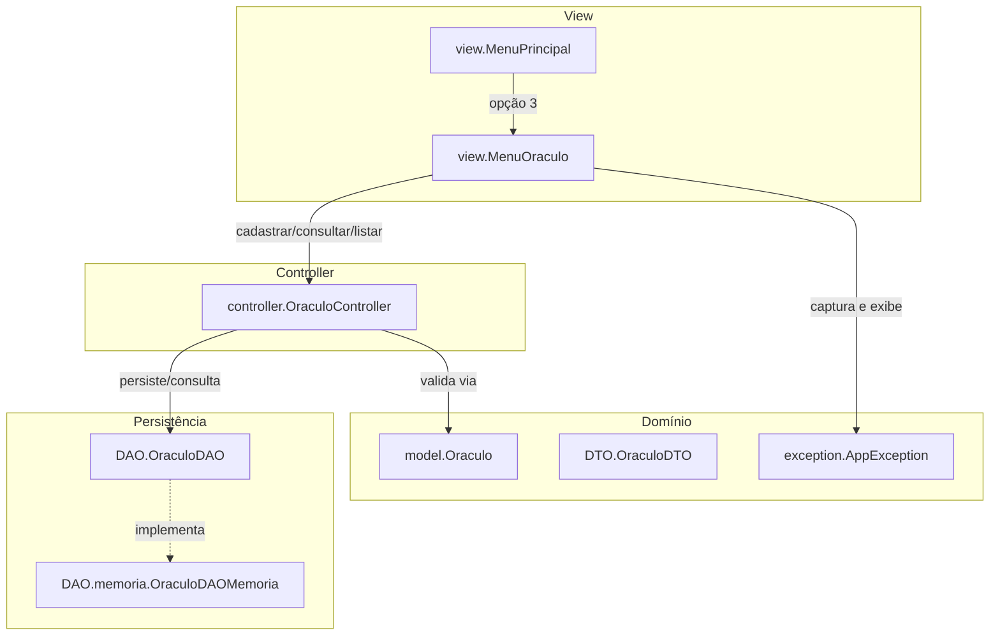
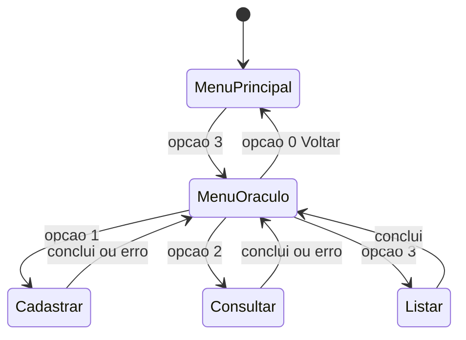
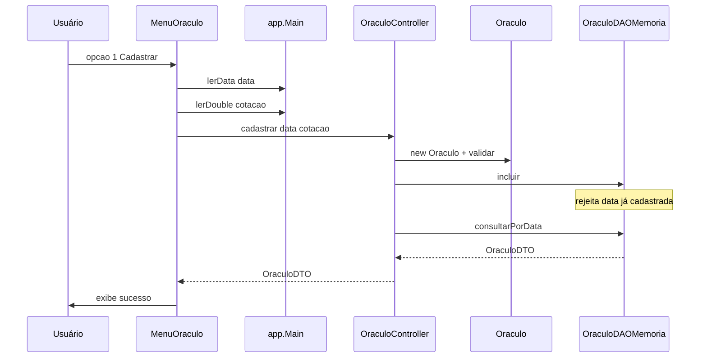

# Fluxo de Oráculo (FT_Coin)

Este documento descreve o fluxo do **Oráculo** — o cadastro, a consulta e a listagem das cotações diárias usadas para validar movimentações e calcular relatórios.

---

## 1. Visão geral

O Oráculo segue o mesmo padrão **MVC + DTO + DAO** das demais funcionalidades, com persistência em memória.

### Papel de cada componente

| Componente | Arquivo | Responsabilidade |
|------------|---------|------------------|
| **MenuOraculo** | [src/view/MenuOraculo.java](../src/view/MenuOraculo.java) | Submenu cadastrar/consultar/listar; lê data e cotação |
| **OraculoController** | [src/controller/OraculoController.java](../src/controller/OraculoController.java) | Valida e orquestra cadastro, consulta e listagem |
| **Oraculo (model)** | [src/model/Oraculo.java](../src/model/Oraculo.java) | Valida data e cotação (> 0); `fromDTO()` / `toDTO()` |
| **OraculoDTO** | [src/DTO/OraculoDTO.java](../src/DTO/OraculoDTO.java) | Transporte: `data`, `cotacao` |
| **OraculoDAO** | [src/DAO/OraculoDAO.java](../src/DAO/OraculoDAO.java) | Contrato: incluir, consultar por data, listar todas, existe |
| **OraculoDAOMemoria** | [src/DAO/memoria/OraculoDAOMemoria.java](../src/DAO/memoria/OraculoDAOMemoria.java) | `Map<LocalDate, OraculoDTO>`; listagem ordenada por data |

---

## 2. Navegação no menu

---

## 3. Operações

### 3.1 Cadastrar cotação

### 3.2 Consultar e listar

- **Consultar:** informa uma data; o DAO retorna a cotação ou lança `AppException` se não houver.
- **Listar:** retorna todas as cotações ordenadas por data crescente (`OraculoDAO.listarTodas()`).

---

## 4. Regras e validações

| Regra | Origem |
|-------|--------|
| Data obrigatória | `Oraculo.validar()` |
| Cotação maior que zero | `Oraculo.validar()` |
| Não duplicar cotação na mesma data | `OraculoDAOMemoria.incluir()` |
| Data sem cotação ao consultar | `OraculoDAOMemoria.consultarPorData()` |

---

## 5. Relação com os outros fluxos

- **Movimentação:** ao registrar compra/venda, a data precisa ter cotação cadastrada.
- **Relatórios:** o cálculo de ganho/perda usa a cotação da data de cada movimentação e a cotação de hoje (ver [fluxo-relatorios.md](fluxo-relatorios.md)).
