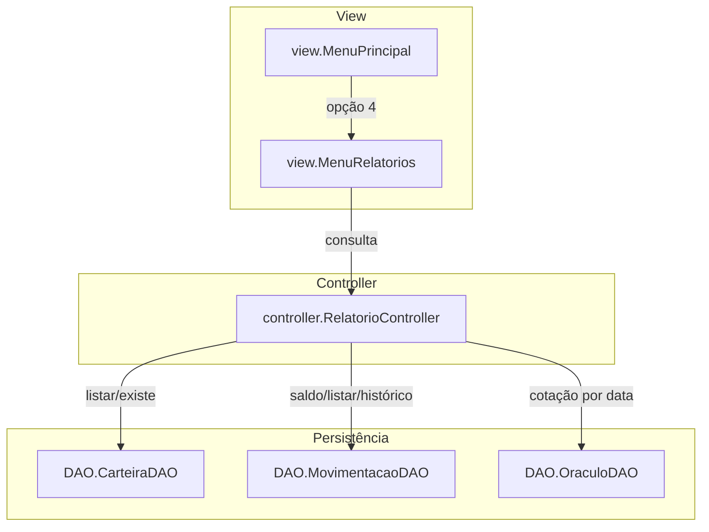
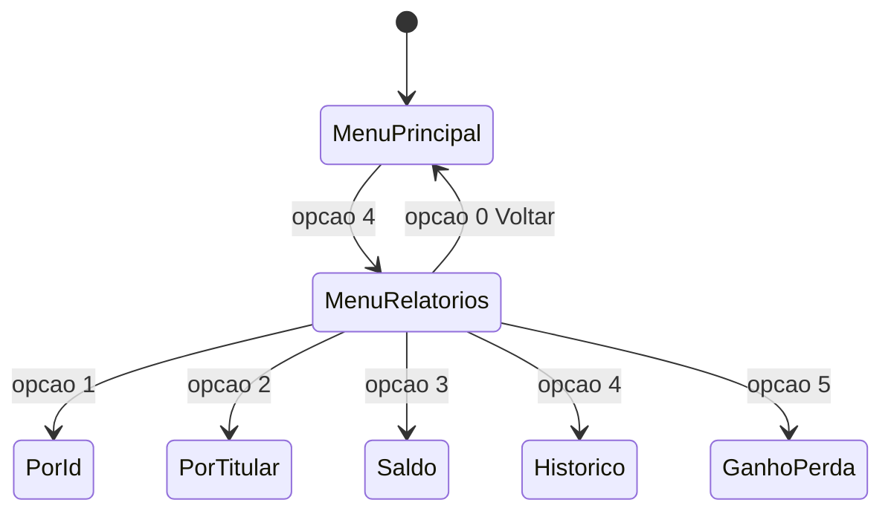
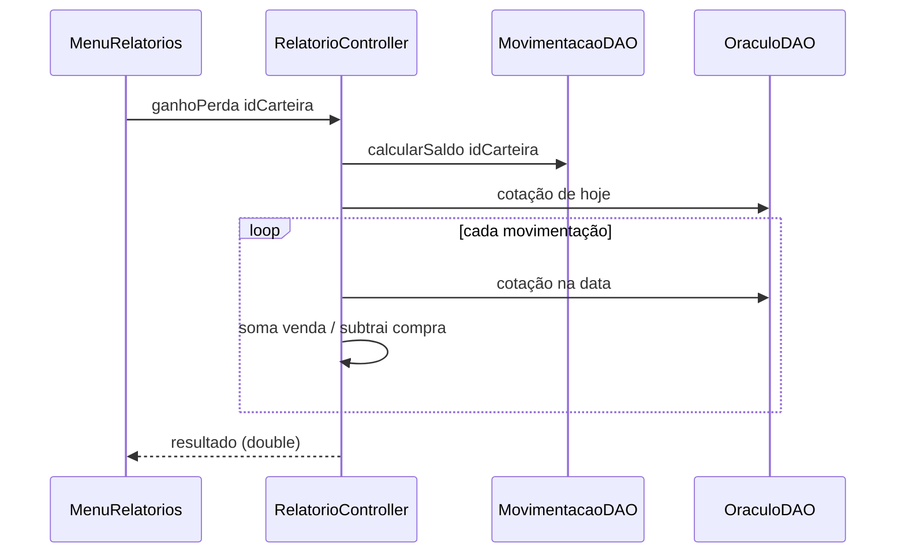

# Fluxo de Relatórios (FT_Coin)

Este documento descreve o fluxo de **Relatórios**: listagens de carteiras, saldo, histórico de movimentação e o cálculo de **ganho/perda** por carteira usando as cotações do Oráculo.

---

## 1. Visão geral

O `RelatorioController` é somente leitura e combina os três DAOs (carteira, movimentação e oráculo).



### Papel de cada componente

| Componente | Arquivo | Responsabilidade |
|------------|---------|------------------|
| **MenuRelatorios** | [src/view/MenuRelatorios.java](../src/view/MenuRelatorios.java) | Submenu de relatórios; lê IDs e exibe resultados |
| **RelatorioController** | [src/controller/RelatorioController.java](../src/controller/RelatorioController.java) | Listagens ordenadas, saldo, histórico e ganho/perda |
| **CarteiraDAO** | [src/DAO/CarteiraDAO.java](../src/DAO/CarteiraDAO.java) | `listarTodas()`, `existe()` |
| **MovimentacaoDAO** | [src/DAO/MovimentacaoDAO.java](../src/DAO/MovimentacaoDAO.java) | `calcularSaldo()`, `listarPorCarteira()` |
| **OraculoDAO** | [src/DAO/OraculoDAO.java](../src/DAO/OraculoDAO.java) | `consultarPorData()`, `existe()` |

---

## 2. Navegação no menu



---

## 3. Operações

| Opção | Método do controller | Descrição |
|-------|----------------------|-----------|
| 1. Buscar por identificador | `listarPorIdentificador()` | Carteiras ordenadas pelo `id` |
| 2. Buscar por titular | `listarPorTitular()` | Carteiras ordenadas pelo `nomeTitular` (case-insensitive) |
| 3. Saldo atual | `calcularSaldo(id)` | Σ compras − Σ vendas (quantidade) |
| 4. Histórico de movimentação | `historico(id)` | Movimentações da carteira ordenadas por data |
| 5. Ganhos e perdas | `ganhoPerda(id)` | Resultado patrimonial por carteira (ver seção 4) |

---

## 4. Cálculo de ganho/perda (patrimonial)

O resultado considera o valor atual da posição mais o caixa movimentado, tudo avaliado pela cotação do Oráculo na data correspondente:

```
saldoAtual = Σ compras.qtd − Σ vendas.qtd
resultado  = saldoAtual * cotacao(hoje)
           + Σ (venda.qtd  * cotacao(data_da_venda))
           − Σ (compra.qtd * cotacao(data_da_compra))
```



A opção 5 do menu percorre todas as carteiras e mostra o resultado de cada uma.

### Pré-condição: cotação de hoje

Se não houver cotação cadastrada para a data atual, `ganhoPerda()` lança `AppException` orientando o cadastro no menu Oráculo. As datas das movimentações já têm cotação garantida, pois isso é validado no momento do registro.

---

## 5. Tratamento de erros

| Origem | Exemplo | Quem lança | Quem captura |
|--------|---------|------------|--------------|
| Identificador inválido | id ≤ 0 | `RelatorioController` | `MenuRelatorios` |
| Carteira inexistente | id não cadastrado | `RelatorioController` | `MenuRelatorios` |
| Sem cotação para hoje | ganho/perda sem cotação atual | `RelatorioController` | `MenuRelatorios` (por carteira) |
| Entrada numérica inválida | "abc" como ID | `Main.lerInteiro()` | `MenuRelatorios` |
